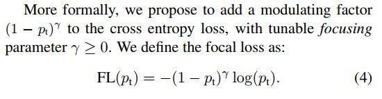
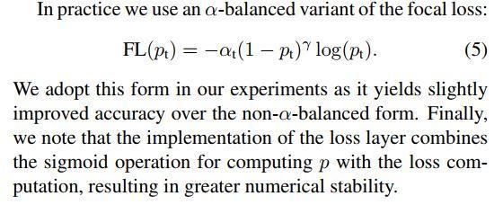
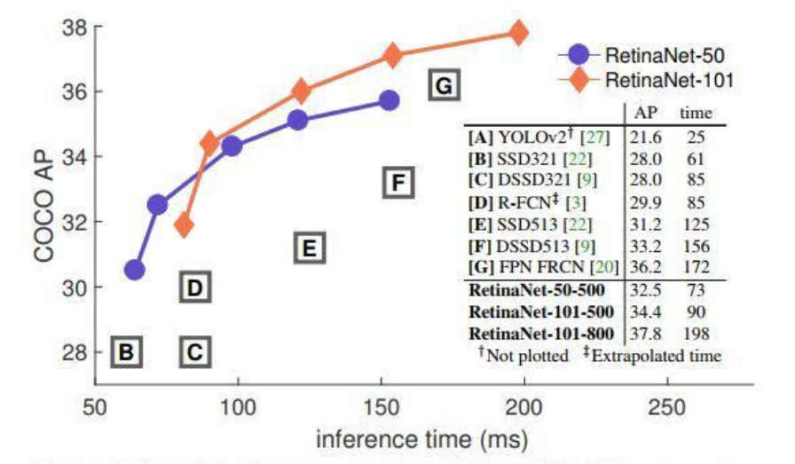

GIthub使用指北:

**1.想将项目拷贝到自己帐号下就fork一下.**

**2.持续关注项目更新就star一下**

**3.watch是设置接收邮件提醒的.**

jupyter-notebook用法例子 请见:[由于Github是国外网站,加载会稍慢](https://github.com/yatengLG/Focal-Loss-Pytorch/blob/master/Demo.ipynb)
 
 retinanet的实现请见:[Retinanet-pytorch](https://github.com/yatengLG/Retinanet-Pytorch)

---

# pytorch 实现 focal loss

[retinanet](https://arxiv.org/abs/1708.02002)论文损失函数

实现过程简易明了,全中文备注.

## 参数说明

* **alpha**参数，是类别损失权重。 

   **用于调节各类别对损失的影响**，具体作用与torch实现的CrossEntropyLoss中的weight参数一致。
   
   你可以输入一个float，比如0.25，则最终的alpha将是[0.25， 0.75， 0.75， 0.75， ...]，这种情况一般用于目标检测，用来抑制背景类对损失的影响；你也可以直接输入一个列表，直接为每一类指定损失权重。
   
* **gamma**参数，是难易度系数，也是focal loss不同于交叉熵的最大区别。
   
   **用于调整训练过程中难识别样本与易识别样本对损失的影响**。

## 参数设置

通常情况下，设置好num_classes直接调用就可以了。

* **alhpa**参数
   
   可以参考各类别样本数据量比例，来设置alpha参数。
   
   但更建议的是，进行多次训练:
   
   1. 初次训练时，可以将alpha设置为一个值全为1的列表，使各个类别平等的去影响损失。
  
  2. 测试结果后，针对想提高的类别，给予一个较其他类大的权重值，加大该类对损失的影响，继续训练模型，使模型在训练时更倾向于该类。例如5分类任务中，设置alpha=[1, 1, 2, 3, 1]，加大第三类、第四类对损失的影响，提高这两类的分类精度。
   
* **gamma**参数

   **gamma参数只推荐设置为2**。
   
## 交叉熵损失

### 带平衡因子的交叉熵

## Focal损失
加入 (1-pt)γ 平衡难易样本的权重,通过γ缩放因子调整,retinanet默认γ=2

### 带平衡因子的Focal损失
论文中最终为带平衡因子的focal loss, 本项目实现的也是这个版本

# 最终retinanet的效果
### 不同γ 值收敛效果

### retinanet与其他检测模型对比

